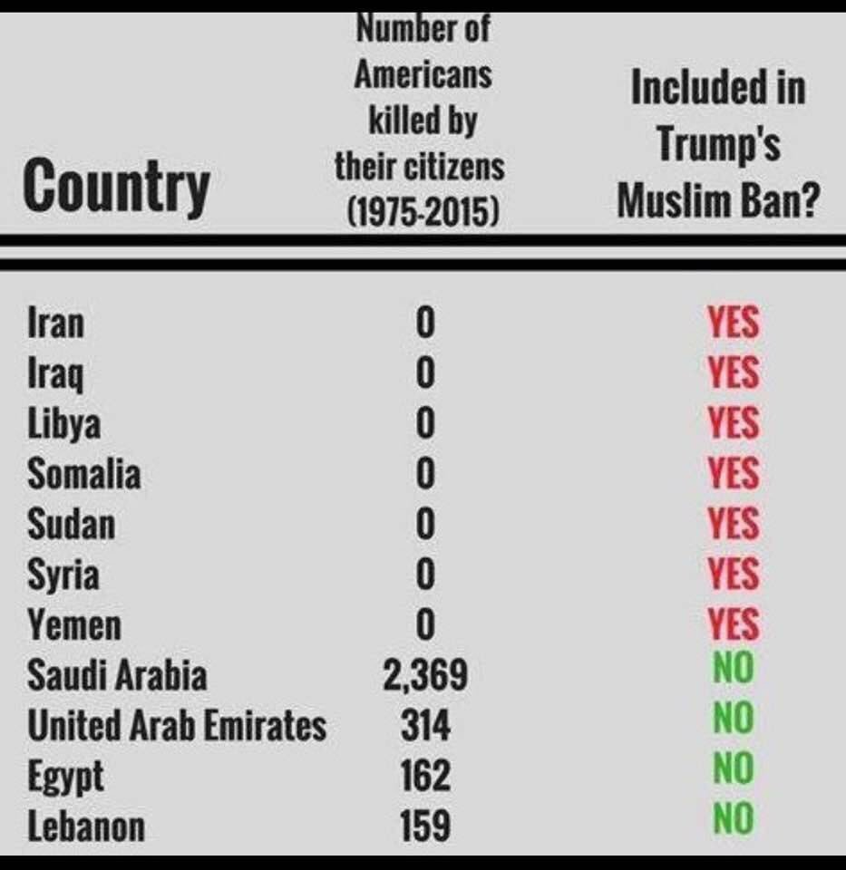

# "extreme vetting"

Note that the count numbers are at present poorly sourced (see footnote), and quite possibly out of date or wrong.    
Do feel free to submit a pull request if you have a better-referenced source of this type of data.    
Also note that count regression on small numbers of observations is usually a crappy idea... 

```r
library(MASS)
counts <- read.csv("extremeVetting.csv", row.names=1)
show(counts)
```

The data, as it currently stands:

```r
data frame with 11 rows and 3 columns
                     americansKilled extremeVetting sourceOfKillers
                           <numeric>      <logical>       <logical>
Iran                               0           TRUE           FALSE
Iraq                               0           TRUE           FALSE
Libya                              0           TRUE           FALSE
Somalia                            0           TRUE           FALSE
Sudan                              0           TRUE           FALSE
Syria                              0           TRUE           FALSE
Yemen                              0           TRUE           FALSE
Saudi Arabia                    2369          FALSE            TRUE
United Arab Emirates             314          FALSE            TRUE
Egypt                            162          FALSE            TRUE
Lebanon                          159          FALSE            TRUE
```

An overdispersed regression for counts dead vs. vetting status:

```r
summary(glm.nb(americansKilled ~ extremeVetting, data=counts))
```

Results:

```r
Coefficients:
                  Estimate  Std. Error  z value            Pr(>|z|)    
(Intercept)       6.621406    0.545872 12.12996 <0.0000000000000002 ***
extremeVetting  -27.923991 9685.037758 -0.00288              0.9977    
---
Signif. codes:  0 '***' 0.001 '**' 0.01 '*' 0.05 '.' 0.1 ' ' 1
```

No particular relationship observed.
We could also model it as true/false:

```r
with(counts, fisher.test(sourceOfKillers, extremeVetting))
```

Results of a binomial test for independence:

```r
	Fisher's Exact Test for Count Data

data:  sourceOfKillers and extremeVetting
p-value = 0.0030303
alternative hypothesis: true odds ratio is not equal to 1
95 percent confidence interval:
 0.000000000 0.389001111
sample estimates:
odds ratio 
         0 
```

The observed inverse relationsip is "statistically significant" (as if anyone needed a test to detect this), i.e.,
unlikely due to chance.  Of course the case is often made that "this is why there aren't terrorists from $country"
but that suggests some sort of clairvoyance in terms of legislation, which is... not often observed in practice.

Clearly, "more reasearch is needed" (commence eye-rolling).

Footnote: found source image.  Still unattributed AFAIK.


